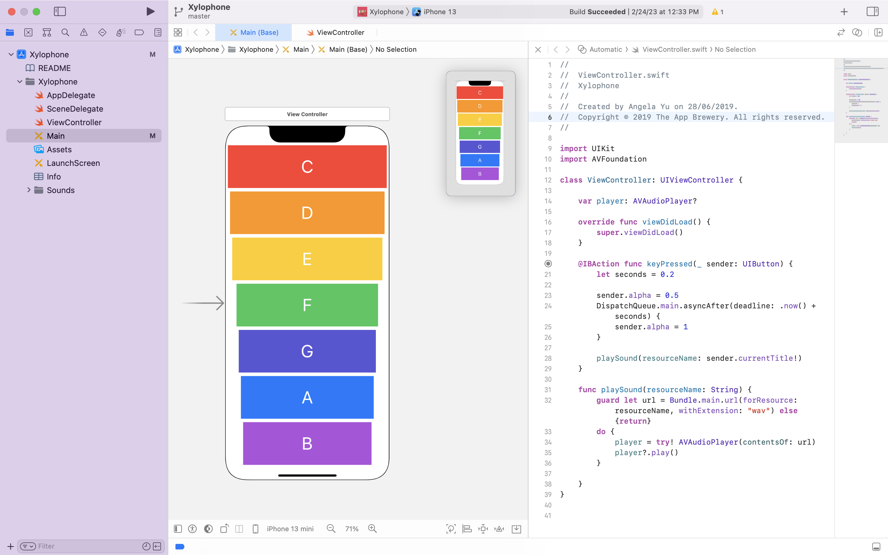

## The App

You will be making your first musical instrument! Music apps are so popular on the App Store that they even get their own category. So in this module, we’re going to make a colourful XyloPhone app. Get it? Ok, the jokes are bad, but remember, I only wrote the good ones... 

## What I learnt

* How to play sound using AVFoundation and AVAudioPlayer.
* Understand Apple documentation and how to use StackOverflow.
* Functions and methods in Swift. 
* Data types.
* Swift loops.
* Variable scope.
* The ViewController lifecycle.
* Error handling in Swift.
* Code refactoring.
* Basic debugging.

## The Code

When each key is clicked to play the saved .wav file, the following code is triggered to call the playSound() function. The alpha attribute of the 
key is set to half and they set back to max using delay in the main thread.

```swift
@IBAction func keyPressed(_ sender: UIButton) {
        let seconds = 0.2
        
        sender.alpha = 0.5
        DispatchQueue.main.asyncAfter(deadline: .now() + seconds) {
            sender.alpha = 1
        }
        
        playSound(resourceName: sender.currentTitle!)
}
```

And here's the playSound() function that actually plays the .wav file using the AVAudioPlayer library imported through the AVFoundation library 
into the code.

```swift
func playSound(resourceName: String) {
        guard let url = Bundle.main.url(forResource: resourceName, withExtension: "wav") else {return}
        do {
            player = try! AVAudioPlayer(contentsOf: url)
            player?.play()
        }
        
}
```

The complete code:

```swift
import UIKit
import AVFoundation

class ViewController: UIViewController {
    
    var player: AVAudioPlayer?

    override func viewDidLoad() {
        super.viewDidLoad()
    }
    
    @IBAction func keyPressed(_ sender: UIButton) {
        let seconds = 0.2
        
        sender.alpha = 0.5
        DispatchQueue.main.asyncAfter(deadline: .now() + seconds) {
            sender.alpha = 1
        }
        
        playSound(resourceName: sender.currentTitle!)
    }
    
    func playSound(resourceName: String) {
        guard let url = Bundle.main.url(forResource: resourceName, withExtension: "wav") else {return}
        do {
            player = try! AVAudioPlayer(contentsOf: url)
            player?.play()
        }
        
    }
}
```

Screenshot of the Xylophone app on Xcode:



A video of the Xylophone app running on an emulator device:

https://user-images.githubusercontent.com/34939672/221531899-fbff80cf-8f6d-41a2-999c-d827c979697e.mov


</br>
</br>
>This is a companion project to The App Brewery's Complete App Development Bootcamp, check out the full course at [www.appbrewery.co](https://www.appbrewery.co/)


